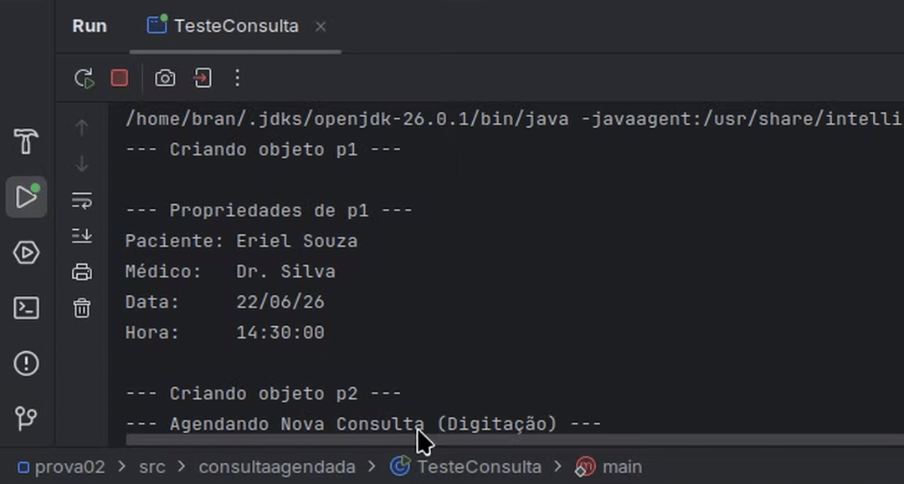

# Trabalho Prático (Substitutiva P2) - CBTLPR1

- **Curso:** Análise e Desenvolvimento de Sistemas 

- **Disciplina:** Linguagem de Programação 1 (ADS 371) - Professor Wellington Tuler Moraes

- **Trabalho:** Prova 02

**Autores:**
- Brandon Oliveira Simões
- Eriel de Jesus Souza

## Programa em Funcionamento

Abaixo está o GIF demonstrando a execução do programa:

## Estrutura da Classe ConsultaAgendada

### Atributos
| Modificador | Tipo | Nome |
|-------------|------|------|
| `-` (private) | `Data` | `data` |
| `-` (private) | `Hora` | `hora` |
| `-` (private) | `String` | `nomePaciente` |
| `-` (private) | `int` (static) | `quantidade` |
| `-` (private) | `String` | `nomeMedico` |

### Métodos

| Método | Descrição |
|--------|-----------|
| `+ ConsultaAgendada()` | Construtor que permite a digitação dos valores de data, hora, nome do paciente e do médico. Acresce 1 no atributo quantidade. |
| `+ ConsultaAgendada(int h, int mi, int s, int d, int m, int a, String p, String m)` | Construtor que recebe valores primitivos por parâmetro. Acresce 1 no atributo quantidade. |
| `+ ConsultaAgendada(Data d, Hora h, String p, String m)` | Construtor que recebe objetos Data e Hora, além de Strings por parâmetro. Acresce 1 no atributo quantidade. |
| `+ setData(int a, int b, int c)` | Altera os valores de data a partir dos parâmetros recebidos. |
| `+ setData()` | Permite alterar a data através da digitação de novos valores. |
| `+ setHora(int a, int b, int c)` | Altera os valores de hora a partir dos parâmetros recebidos. |
| `+ setHora()` | Permite alterar a hora através da digitação de novos valores. |
| `+ setNomePaciente(String p)` | Altera o nome do paciente a partir do parâmetro recebido. |
| `+ setNomePaciente()` | Permite alterar o nome do paciente através da digitação de um novo valor. |
| `+ setNomeMedico(String m)` | Altera o nome do médico a partir do parâmetro recebido. |
| `+ setNomeMedico()` | Permite alterar o nome do médico através da digitação de um novo valor. |
| `+ getAmostra(): int` | Método estático que devolve a quantidade total de consultas agendadas. |
| `+ getData(): String` | Devolve a data no formato `dd/mm/aa`. |
| `+ getHora(): String` | Devolve a hora no formato `hh:mm:ss`. |
| `+ getNomePaciente(): String` | Devolve o nome do paciente armazenado. |
| `+ getNomeMedico(): String` | Devolve o nome do médico armazenado. |

## Exercícios Realizados

### Exercício 01
Reescrita das propriedades e métodos da classe `Data`, deixando-os de acordo com o padrão UML (Getter e Setter). Está resolvido em `Ex01.txt`.

### Exercício 02
Criação da classe `ConsultaAgendada` com todos os seus atributos estáticos, de instância e métodos (Getters, Setters e construtores sobrecarregados), conforme diagrama UML e exigências de negócio.

### Exercício 03
Desenvolvimento do código na classe principal (`TesteConsulta.java`) para testar `ConsultaAgendada`, instanciando os objetos `p1` (via construtor parametrizado) e `p2` (via construtor padrão), exibindo e alterando as propriedades.

### Exercício 04
Implementação da escrita de todo o resultado obtido no Exercício 03 em um arquivo texto (`resultado_exercicio04.txt`).
