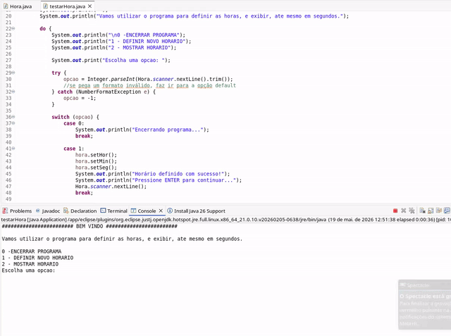

# Trabalho Prático 03 - LPR1

**Curso:** Análise e Desenvolvimento de Sistemas 
**Disciplina:** Linguagem de Programação 1 
**Trabalho:** TP03 - Classe Hora

**Dupla:**
- Brandon Oliveira Simões
- Eriel de Jesus Souza

## Programa em Funcionamento

Abaixo está o GIF demonstrando a execução do programa:

##  Estrutura da Classe Hora

### Atributos
| Modificador | Tipo | Nome |
|-------------|------|------|
| `-` (private) | `int` | `hora` |
| `-` (private) | `int` | `min` |
| `-` (private) | `int` | `seg` |

### Métodos

| Método | Descrição |
|--------|-----------|
| `+ Hora()` | Construtor que permite ao usuário digitar os valores de hora, minuto e segundos. Os valores são consistentes e só aceitos se válidos, caso contrário, exige redigitação. |
| `+ Hora(int h, int m, int s)` | Construtor que recebe valores e inicializa os atributos da classe. |
| `+ setHor(int h)` | Recebe um valor e atribui ao atributo `hora`. |
| `+ setMin(int m)` | Recebe um valor e atribui ao atributo `min`. |
| `+ setSeg(int s)` | Recebe um valor e atribui ao atributo `seg`. |
| `+ setHor()` | Permite que o usuário digite um valor e atribui ao `hora`. O valor é consistido e só aceito se válido. |
| `+ setMin()` | Permite que o usuário digite um valor e atribui ao `min`. O valor é consistido e só aceito se válido. |
| `+ setSeg()` | Permite que o usuário digite um valor e atribui ao `seg`. O valor é consistido e só aceito se válido. |
| `+ getHor(): int` | Devolve o valor da propriedade `hora`. |
| `+ getMin(): int` | Devolve o valor da propriedade `min`. |
| `+ getSeg(): int` | Devolve o valor da propriedade `seg`. |
| `+ getHora1(): String` | Devolve a hora no formato `hh:mm:ss`. |
| `+ getHora2(): String` | Devolve a hora no formato `hh:mm:ss (AM/PM)`. |
| `+ getSegundos(): int` | Devolve a quantidade de segundos expressa na hora (exemplo: 01:00:01 = 3601 segundos). |

## Exercício 01

Criar a classe `Hora.java` conforme especificação acima.

## Exercício 02

Desenvolver um programa `testarHora.java` capaz de testar a classe e todos os métodos desenvolvidos no exercício anterior.

