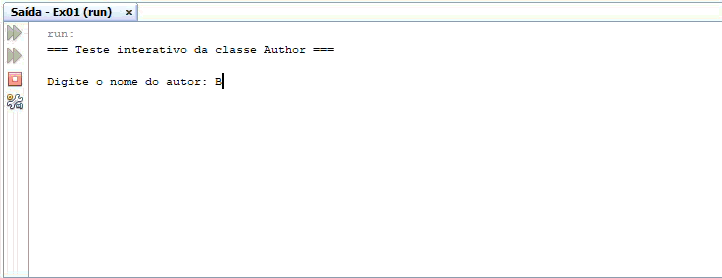

# Trabalho Prático - LPR1

**Curso:** Análise e Desenvolvimento de Sistemas 

**Disciplina:** Linguagem de Programação 2

**Trabalho:** Exercício 01 - Classe Author

**Dupla:** Brandon Oliveira Simões e Eriel de Jesus Souza

## Programa em Funcionamento

Abaixo está o GIF demonstrando a execução do programa:

## Estrutura da Classe Author

### Atributos
| Modificador | Tipo | Nome |
|-------------|------|------|
| `-` (private) | `String` | `name` |
| `-` (private) | `String` | `email` |
| `-` (private) | `char` | `gender` |

### Métodos

| Método | Descrição |
|--------|-----------|
| `+ Author(String name, String email, char gender)` | Construtor que recebe os valores e inicializa os atributos da classe. Valida se o gênero é 'm' ou 'f'. |
| `+ getName(): String` | Devolve o valor da propriedade `name`. |
| `+ getEmail(): String` | Devolve o valor da propriedade `email`. |
| `+ setEmail(String email)` | Recebe um valor e atribui ao atributo `email`. |
| `+ getGender(): char` | Devolve o valor da propriedade `gender`. |
| `+ toString(): String` | Devolve a representação textual do objeto no formato `Author[name=?,email=?,gender=?]`. |

### Restrições

- Não existe construtor default para `Author`.
- Não existem setters para `name` e `gender`, estes atributos são imutáveis após a criação do objeto.

## Exercício

Criar a classe `Author.java` conforme especificação acima.
Desenvolver um programa `testeAuthorEx01.java` capaz de testar a classe e todos os métodos desenvolvidos no exercício anterior, incluindo:

- Testar construtor
- Verificar o método `toString()`
- Testar o Setter
- Testar os Getters
