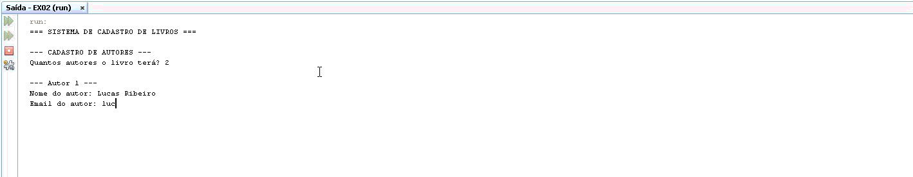

# Trabalho Prático - LPR1

**Curso:** Análise e Desenvolvimento de Sistemas 

**Disciplina:** Linguagem de Programação 2

**Trabalho:** Exercício 02 - Classe Book

**Dupla:** Brandon Oliveira Simões e Eriel de Jesus Souza

## Programa em Funcionamento

Abaixo está o GIF demonstrando a execução do programa:

## Estrutura da Classe Book

### Atributos
| Modificador | Tipo | Nome |
|-------------|------|------|
| `-` (private) | `String` | `name` |
| `-` (private) | `Author[]` | `authors` |
| `-` (private) | `double` | `price` |
| `-` (private) | `int` | `qty` |

### Métodos

| Método | Descrição |
|--------|-----------|
| `+ Book(String name, Author[] authors, double price)` | Construtor que recebe o nome, array de autores e preço, inicializando a quantidade com 0. |
| `+ Book(String name, Author[] authors, double price, int qty)` | Construtor que recebe o nome, array de autores, preço e quantidade, inicializando todos os atributos. |
| `+ getName(): String` | Devolve o valor da propriedade `name`. |
| `+ getAuthors(): Author[]` | Devolve uma cópia do array de autores para garantir a imutabilidade. |
| `+ getPrice(): double` | Devolve o valor da propriedade `price`. |
| `+ setPrice(double price)` | Recebe um valor e atribui ao atributo `price`. |
| `+ getQty(): int` | Devolve o valor da propriedade `qty`. |
| `+ setQty(int qty)` | Recebe um valor e atribui ao atributo `qty`. |
| `+ getAuthorNames(): String` | Devolve uma string com os nomes dos autores separados por vírgula. |
| `+ toString(): String` | Devolve a representação textual do objeto no formato `Book[name=?,authors={Author[name=?,email=?,gender=?], ...},price=?,qty=?]`. |

### Restrições

- Uma vez que o livro é instanciado, seus autores não podem ser adicionados ou removidos.
- O array de autores é imutável após a criação do objeto (garantido pelo `getAuthors()` retornar uma cópia).
- O método `toString()` deve exibir todos os autores no formato especificado.

## Estrutura da Classe Author (Reutilizada do Exercício 01)

### Atributos
| Modificador | Tipo | Nome |
|-------------|------|------|
| `-` (private) | `String` | `name` |
| `-` (private) | `String` | `email` |
| `-` (private) | `char` | `gender` |

### Métodos

| Método | Descrição |
|--------|-----------|
| `+ Author(String name, String email, char gender)` | Construtor que recebe os valores e inicializa os atributos da classe. Valida se o gênero é 'm' ou 'f'. |
| `+ getName(): String` | Devolve o valor da propriedade `name`. |
| `+ getEmail(): String` | Devolve o valor da propriedade `email`. |
| `+ setEmail(String email)` | Recebe um valor e atribui ao atributo `email`. |
| `+ getGender(): char` | Devolve o valor da propriedade `gender`. |
| `+ toString(): String` | Devolve a representação textual do objeto no formato `Author[name=?,email=?,gender=?]`. |

### Restrições

- Não existe construtor default para `Author`.
- Não existem setters para `name` e `gender`, estes atributos são imutáveis após a criação do objeto.

## Exercício

Criar a classe `Book.java` conforme especificação acima, reutilizando a classe `Author.java` desenvolvida no exercício anterior.

Desenvolver um programa `TestBook.java` capaz de testar a classe e todos os métodos desenvolvidos, incluindo:

- Testar construtores (com e sem quantidade)
- Verificar o método `toString()`
- Testar os Getters
- Testar os Setters
- Testar o método `getAuthorNames()`
- Testar a imutabilidade do array de autores
- Testar a validação do gênero no construtor de Author
