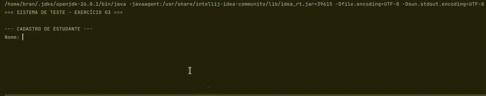

# Trabalho Prático - LPR1

Curso: Analise e Desenvolvimento de Sistemas
Disciplina: Linguagem de Programacao 2
Trabalho: Exercicio 03 - Classes Person, Staff e Student (Heranca)
Dupla: Brandon Oliveira Simoes e Eriel de Jesus Souza

## Programa em Funcionamento

## Diagrama de Classes

Person (superclasse)
- name: String
- address: String
+ Person(name: String, address: String)
+ getName(): String
+ getAddress(): String
+ setAddress(address: String): void
+ toString(): String

Staff (subclasse de Person)
- school: String
- pay: double
+ Staff(name: String, address: String, school: String, pay: double)
+ getSchool(): String
+ setSchool(school: String): void
+ getPay(): double
+ setPay(pay: double): void
+ toString(): String

Student (subclasse de Person)
- program: String
- year: int
- fee: double
+ Student(name: String, address: String, program: String, year: int, fee: double)
+ getProgram(): String
+ setProgram(program: String): void
+ getYear(): int
+ setYear(year: int): void
+ getFee(): double
+ setFee(fee: double): void
+ toString(): String
